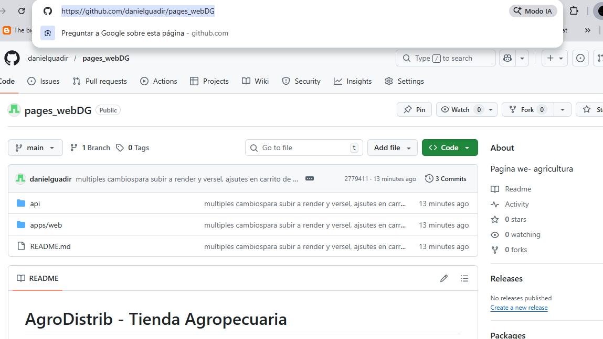

# Deploy Checklist
- [ ] Crear repos en GitHub: agro-api y agro-web
- [ ] Subir api/ a agro-api repo
- [ ] Subir apps/web/ a agro-web repo
- [ ] En Render: Crear Web Service para agro-api, configurar DATABASE_URL
- [ ] En Render Shell: npx prisma migrate deploy, npm run seed, npm run seed:products
- [ ] En Vercel: Crear proyecto para agro-web, configurar VITE_API_URL
- [ ] Probar links finales