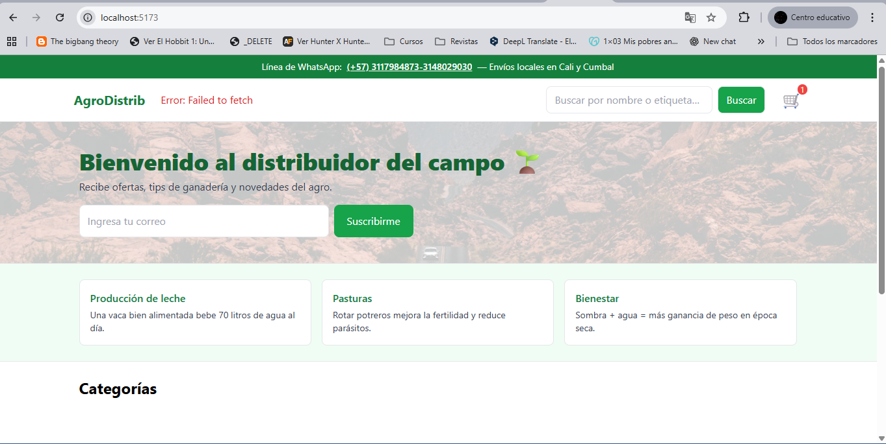

# AgroDistrib - Tienda Agropecuaria

Proyecto full-stack para una tienda de distribución de productos agropecuarios.

## Características
- **Backend**: API REST con Node.js, Express, Prisma y SQLite (desarrollo) / PostgreSQL (producción).
- **Frontend**: React con Vite, Redux Toolkit, Tailwind CSS.
- **Funcionalidades**: Categorías con productos, búsqueda, carrito de compras persistente (localStorage), checkout simulado (pagos en desarrollo).
- **Escalabilidad**: Separado en backend y frontend, fácil de deployar y mantener.

## Estructura
- `api/`: Backend
- `apps/web/`: Frontend

## Deploy

### Backend (Render)
1. Sube la carpeta `api/` a un repo GitHub.
2. Conecta a Render: Web Service.
3. Config: Build `npm install`, Start `npm start`, Env `DATABASE_URL` con PostgreSQL.

### Frontend (Vercel)
1. Sube la carpeta `apps/web/` a un repo GitHub.
2. Conecta a Vercel.
3. Config: Env `VITE_API_URL` con URL de Render.

## Desarrollo Local
- API: `cd api && npm install && npx prisma migrate dev && npm run seed && npm run dev`
- Web: `cd apps/web && npm install && npm run dev`